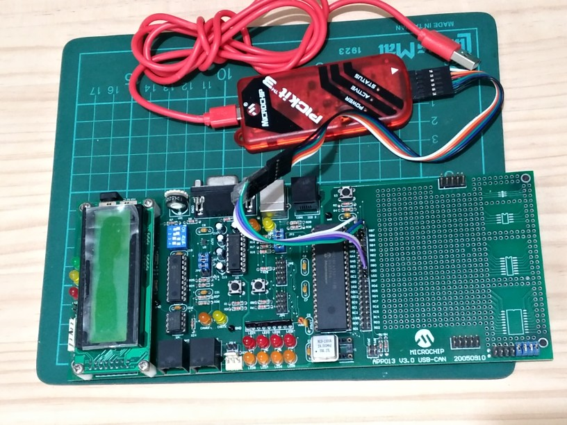
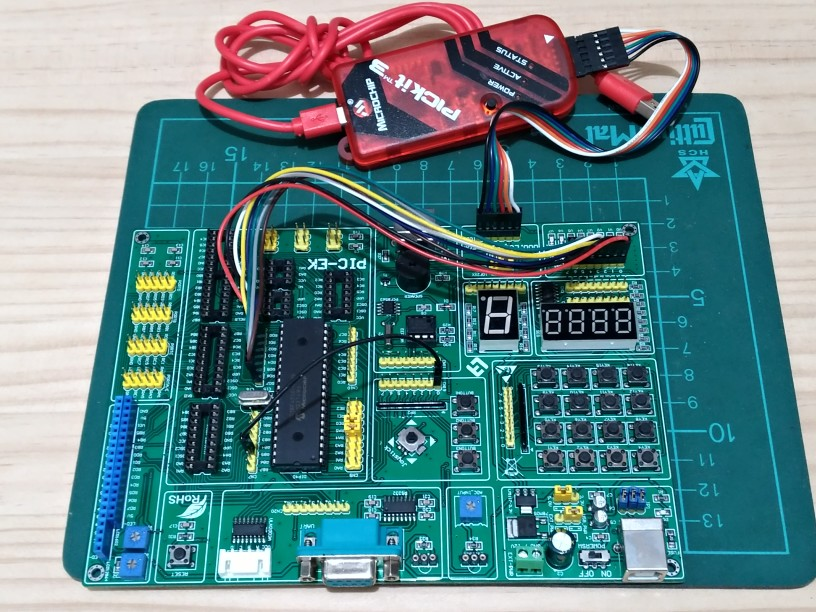
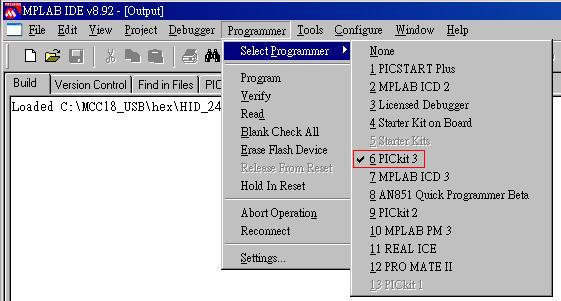
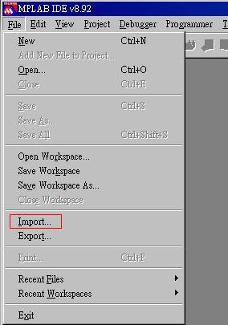
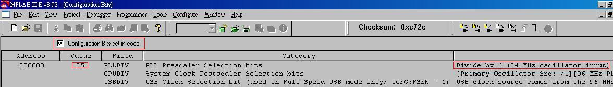
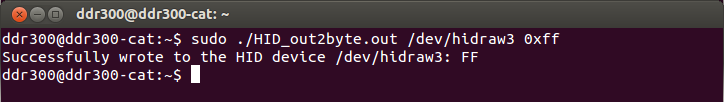
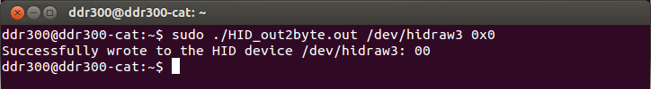

# pic18f4550_HID_LED
pic18f4550 HID class with 8 LEDs on/off  
VID=0xffff  
PID=0x1000  
2 bytes of out end point. 1 of byte for 8 LEDs.  
 

## note
I added a file of cfg_bit.h to specify the settings in pic18f4550.  
Thus, select the file of hex that matches your board.  

 
 
This EVK with 24Mhz xtal.  
 
  
 
This EVK with 20Mhz xtal.  
 

## Flash device of pic18f4550
 
Run MPLAB IDE  
Select your programmer  
 
 
Import the file of hex  
 
 
Check the setting of clock that matches you board  
 

## Test with linux  

 
Turn on 8 of LED.  
 
 
Turn off 8 of LED.  
 

